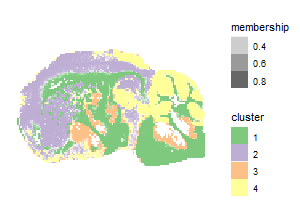
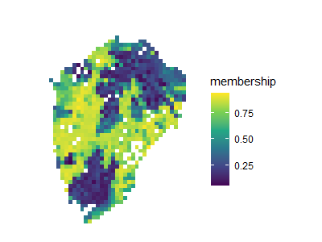
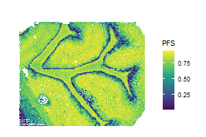

# fcmR - Independent Fuzzy c-means in R

Open source implementation of the fuzzy c-means soft clustering algorithm. This implementation was designed for the study of MSI datasets. Input data format consist of a matrix, in which columns refer to mass peaks and columns the sampling points over a tissue section.

{width="300"}

## Pixel Fidelity Score

This implementation also includes, as a novelty, the computation of the Pixel Fidelity Score (PFS). A score designed for the interpretation of all the cluster's membership over a tissue slide.

